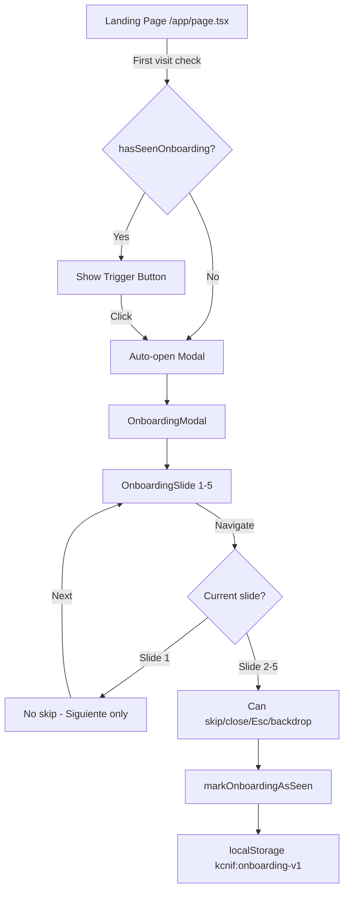
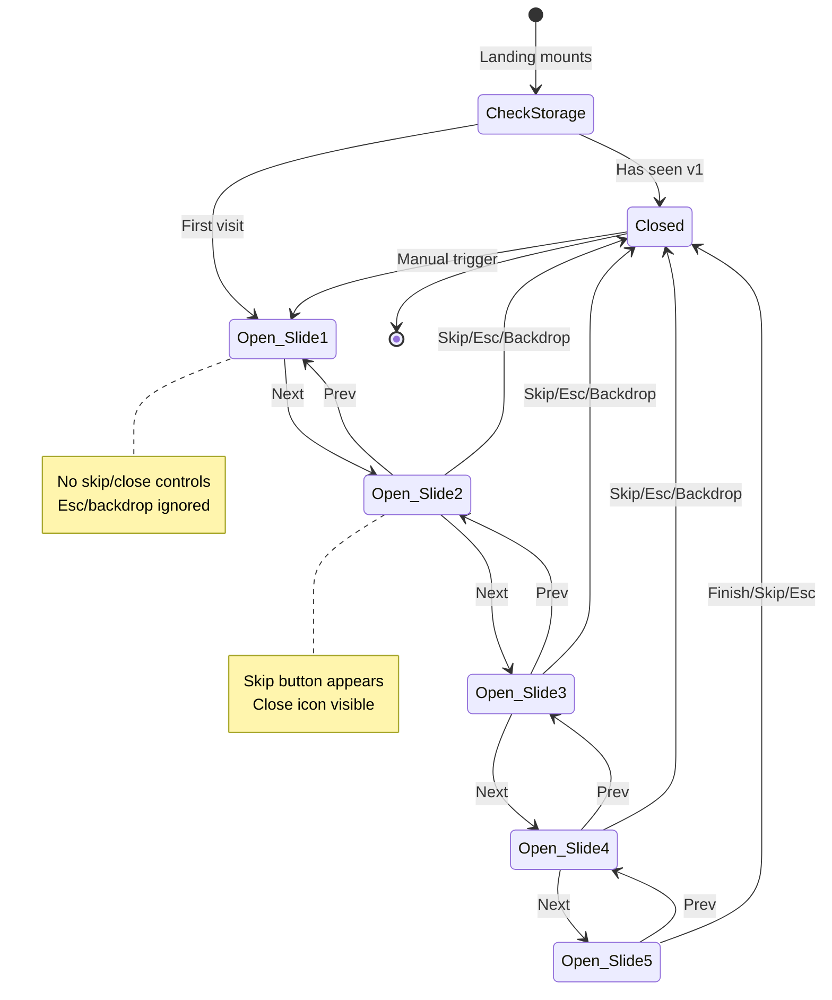
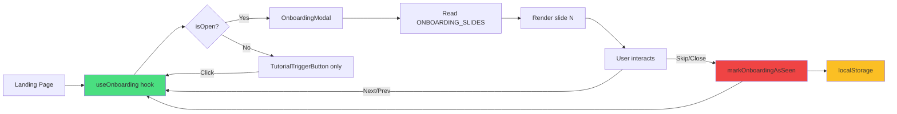

# Design — Onboarding Tutorial

## Overview

El **Onboarding Tutorial** es un sistema de introducción modal interactiva que presenta las mecánicas asimétricas del juego a nuevos jugadores. Aparece automáticamente en la primera visita y permanece accesible vía botón persistente.

**Filosofía de diseño:**
- **Mínima fricción**: 5 slides, 30-45 segundos de lectura total
- **Cooperación desde el inicio**: Slide 1 no omitible (Golden Rule obligatoria)
- **Accesibilidad first**: Focus trap, ARIA completo, navegación por teclado
- **Zero dependencias**: Solo React hooks + localStorage nativo
- **Persistencia versionada**: Invalidación automática cuando el contenido se actualiza

## High-Level Architecture



**Flujo de estado:**

```
Landing mount
  → useOnboarding reads localStorage (version check)
    → NOT seen → isOpen: true, currentSlide: 1
    → SEEN → isOpen: false
  → Manual trigger → openTutorial() → isOpen: true, currentSlide: 1
  → User navigates → nextSlide() / prevSlide() → currentSlide: N
  → User completes/skips → closeTutorial() → write localStorage → isOpen: false
```


## Component Architecture

### Component Hierarchy (Atomic Design)

```
OnboardingModal (organism)
  ├── Backdrop (atom) — bg-black/80, fixed inset-0
  ├── ModalContainer (molecule)
  │   ├── OnboardingProgress (molecule) — "1/5", "2/5"...
  │   ├── CloseButton (atom) — visible only on slides 2-5
  │   ├── OnboardingSlide (molecule)
  │   │   ├── SlideHeading (atom)
  │   │   ├── SlideContent (varies by slide)
  │   │   └── Screenshot (atom) — <Image> with fallback
  │   └── NavigationControls (molecule)
  │       ├── PrevButton (atom) — visible if currentSlide > 1
  │       ├── NextButton (atom) — visible if currentSlide < 5
  │       ├── FinishButton (atom) — visible only on slide 5
  │       └── SkipButton (atom) — visible on slides 2-5

TutorialTriggerButton (atom) — persistent in Landing
```

### File Structure

```
src/features/onboarding/
  components/
    OnboardingModal.tsx          # Main organism - conditional render, focus trap
    OnboardingSlide.tsx           # Renders slide N based on content prop
    OnboardingProgress.tsx        # "N/5" indicator
    NavigationButton.tsx          # Reusable button (Prev/Next/Skip/Finish)
    TutorialTriggerButton.tsx     # "📖 Cómo Jugar" in Landing
  hooks/
    useOnboarding.ts              # State management hook
  logic/
    onboarding-storage.ts         # localStorage read/write/version check
    onboarding-content.ts         # Static slide definitions
  onboarding-types.ts             # TypeScript types
```


## Data Models

### TypeScript Types

```typescript
// onboarding-types.ts

/**
 * Represents a single tutorial slide.
 */
export interface OnboardingSlide {
  readonly id: number;
  readonly heading: string;
  readonly content: React.ReactNode;
  readonly screenshot?: string; // Path relative to /public
  readonly screenshotAlt?: string;
}

/**
 * Persisted state in localStorage.
 */
export interface OnboardingState {
  readonly completed: boolean;
  readonly version: number;
}

/**
 * Internal state managed by useOnboarding hook.
 */
export interface OnboardingHookState {
  readonly isOpen: boolean;
  readonly currentSlide: number; // 1-5
  readonly canSkip: boolean; // false for slide 1, true otherwise
}

/**
 * Return type of useOnboarding hook.
 */
export interface UseOnboardingReturn extends OnboardingHookState {
  readonly openTutorial: () => void;
  readonly closeTutorial: () => void;
  readonly nextSlide: () => void;
  readonly prevSlide: () => void;
  readonly totalSlides: number;
}

export const ONBOARDING_VERSION = 1 as const;
export const TOTAL_SLIDES = 5 as const;
```


### Slide Content Definition

```typescript
// onboarding-content.ts

export const ONBOARDING_SLIDES: readonly OnboardingSlide[] = [
  {
    id: 1,
    heading: '💥 Regla de Oro',
    content: (
      <>
        <p className="text-lg font-semibold text-red-500 mb-4">
          Ningún jugador puede ganar solo. La información está partida por diseño.
        </p>
        <p className="text-zinc-300 mb-3">
          El <span className="text-amber-400 font-medium">Coder</span> ve el código roto y el error, 
          pero NO conoce las reglas del lenguaje ni el dominio.
        </p>
        <p className="text-zinc-300 mb-3">
          El <span className="text-emerald-400 font-medium">Helper</span> tiene la guía completa, 
          pero NO ve el código ni las opciones de diagnóstico.
        </p>
        <p className="text-zinc-400 text-sm italic border-l-2 border-red-500 pl-3 mt-4">
          ⚠️ Esta regla es fundamental — continúa para poder saltar el resto del tutorial.
        </p>
      </>
    ),
  },
  {
    id: 2,
    heading: '👨‍💻 Rol: Coder',
    content: (
      <>
        <p className="text-zinc-300 mb-4">
          El Coder ejecuta el fix — ve síntomas, pero NO la teoría.
        </p>
        <div className="grid grid-cols-2 gap-4 mb-4">
          <div>
            <h4 className="text-emerald-400 font-medium mb-2">✓ Ve:</h4>
            <ul className="text-sm text-zinc-400 space-y-1">
              <li>• Código roto</li>
              <li>• Error del sistema</li>
              <li>• 4 opciones de diagnóstico</li>
              <li>• Timer y vidas</li>
            </ul>
          </div>
          <div>
            <h4 className="text-red-400 font-medium mb-2">✗ NO ve:</h4>
            <ul className="text-sm text-zinc-400 space-y-1">
              <li>• Reglas del lenguaje</li>
              <li>• Conocimiento de dominio</li>
              <li>• Manual de referencia</li>
            </ul>
          </div>
        </div>
        <p className="text-amber-400 text-sm font-medium">
          → Tu misión: describir síntomas verbalmente al Helper.
        </p>
      </>
    ),
    screenshot: '/onboarding/coder_screen.png',
    screenshotAlt: 'Pantalla del Coder mostrando código roto y opciones de diagnóstico',
  },
  // ... slides 3, 4, 5 continue similarly
] as const;
```


## Storage Layer

### localStorage Interface

```typescript
// onboarding-storage.ts

const STORAGE_KEY = 'kcnif:onboarding-v1' as const;

/**
 * Reads onboarding state from localStorage.
 * Returns null if not found or corrupted.
 */
export function readOnboardingState(): OnboardingState | null {
  if (typeof window === 'undefined') return null; // SSR safety
  
  try {
    const raw = localStorage.getItem(STORAGE_KEY);
    if (!raw) return null;
    
    const parsed = JSON.parse(raw) as unknown;
    
    // Validation
    if (
      typeof parsed === 'object' &&
      parsed !== null &&
      'completed' in parsed &&
      'version' in parsed &&
      typeof parsed.completed === 'boolean' &&
      typeof parsed.version === 'number'
    ) {
      return parsed as OnboardingState;
    }
    
    return null; // Invalid structure
  } catch {
    return null; // Corrupted JSON
  }
}

/**
 * Checks if user has seen the current version of the tutorial.
 */
export function hasSeenOnboarding(currentVersion: number): boolean {
  const state = readOnboardingState();
  if (!state) return false;
  
  // Version mismatch → treat as not seen
  return state.completed && state.version >= currentVersion;
}

/**
 * Marks the tutorial as completed for the current version.
 */
export function markOnboardingAsSeen(version: number): void {
  if (typeof window === 'undefined') return;
  
  const state: OnboardingState = {
    completed: true,
    version,
  };
  
  try {
    localStorage.setItem(STORAGE_KEY, JSON.stringify(state));
  } catch {
    // localStorage full or disabled - fail silently
  }
}

/**
 * Clears tutorial state (for testing).
 */
export function resetOnboarding(): void {
  if (typeof window === 'undefined') return;
  localStorage.removeItem(STORAGE_KEY);
}
```


## Hook Design

### useOnboarding Hook

```typescript
// useOnboarding.ts

import { useState, useEffect, useCallback } from 'react';
import { hasSeenOnboarding, markOnboardingAsSeen } from '../logic/onboarding-storage';
import { ONBOARDING_VERSION, TOTAL_SLIDES, type UseOnboardingReturn } from '../onboarding-types';

export function useOnboarding(): UseOnboardingReturn {
  const [isOpen, setIsOpen] = useState(false);
  const [currentSlide, setCurrentSlide] = useState(1);
  
  // Check first visit on mount
  useEffect(() => {
    const shouldShow = !hasSeenOnboarding(ONBOARDING_VERSION);
    if (shouldShow) {
      setIsOpen(true);
      setCurrentSlide(1);
    }
  }, []);
  
  const openTutorial = useCallback(() => {
    setIsOpen(true);
    setCurrentSlide(1);
  }, []);
  
  const closeTutorial = useCallback(() => {
    markOnboardingAsSeen(ONBOARDING_VERSION);
    setIsOpen(false);
  }, []);
  
  const nextSlide = useCallback(() => {
    setCurrentSlide((prev) => Math.min(prev + 1, TOTAL_SLIDES));
  }, []);
  
  const prevSlide = useCallback(() => {
    setCurrentSlide((prev) => Math.max(prev - 1, 1));
  }, []);
  
  const canSkip = currentSlide > 1;
  
  return {
    isOpen,
    currentSlide,
    canSkip,
    openTutorial,
    closeTutorial,
    nextSlide,
    prevSlide,
    totalSlides: TOTAL_SLIDES,
  };
}
```

**Key decisions:**
- **Pure React hooks**: No external state management
- **Auto-open on mount**: Check happens in useEffect, not during render
- **Slide bounds**: Math.min/max prevent out-of-range navigation
- **canSkip computed**: Derived from currentSlide, not stored


## Component Implementation

### OnboardingModal (Organism)

```typescript
// OnboardingModal.tsx
'use client';

import { useEffect, useRef } from 'react';
import { OnboardingSlide } from './OnboardingSlide';
import { OnboardingProgress } from './OnboardingProgress';
import { NavigationButton } from './NavigationButton';
import { ONBOARDING_SLIDES } from '../logic/onboarding-content';
import type { UseOnboardingReturn } from '../onboarding-types';

interface OnboardingModalProps {
  readonly hookState: UseOnboardingReturn;
}

export function OnboardingModal({ hookState }: OnboardingModalProps) {
  const {
    isOpen,
    currentSlide,
    canSkip,
    closeTutorial,
    nextSlide,
    prevSlide,
    totalSlides,
  } = hookState;
  
  const modalRef = useRef<HTMLDivElement>(null);
  const firstFocusableRef = useRef<HTMLButtonElement>(null);
  
  // Focus trap implementation
  useEffect(() => {
    if (!isOpen) return;
    
    // Focus first interactive element on open
    firstFocusableRef.current?.focus();
    
    // Keyboard handlers
    const handleKeyDown = (e: KeyboardEvent) => {
      if (e.key === 'Escape' && canSkip) {
        closeTutorial();
      } else if (e.key === 'ArrowRight' && currentSlide < totalSlides) {
        nextSlide();
      } else if (e.key === 'ArrowLeft' && currentSlide > 1) {
        prevSlide();
      }
    };
    
    document.addEventListener('keydown', handleKeyDown);
    return () => document.removeEventListener('keydown', handleKeyDown);
  }, [isOpen, currentSlide, canSkip, closeTutorial, nextSlide, prevSlide, totalSlides]);
  
  if (!isOpen) return null;
  
  const slide = ONBOARDING_SLIDES[currentSlide - 1];
  const isLastSlide = currentSlide === totalSlides;
  
  return (
    <div 
      className="fixed inset-0 z-50 flex items-center justify-center"
      role="dialog"
      aria-modal="true"
      aria-labelledby="onboarding-heading"
    >
      {/* Backdrop */}
      <div 
        className="absolute inset-0 bg-black/80"
        onClick={canSkip ? closeTutorial : undefined}
        aria-hidden="true"
      />
      
      {/* Modal Container */}
      <div 
        ref={modalRef}
        className="relative z-10 w-full max-w-3xl mx-4 bg-[#0a0a0b] border border-zinc-800 rounded-lg shadow-2xl overflow-hidden"
      >
        {/* Header */}
        <div className="flex items-center justify-between p-4 border-b border-zinc-800">
          <OnboardingProgress current={currentSlide} total={totalSlides} />
          {canSkip && (
            <button
              onClick={closeTutorial}
              className="text-zinc-400 hover:text-zinc-200 transition-colors"
              aria-label="Cerrar tutorial"
            >
              ✕
            </button>
          )}
        </div>
        
        {/* Slide Content */}
        <div className="p-6">
          <OnboardingSlide slide={slide} />
        </div>
        
        {/* Navigation */}
        <div className="flex items-center justify-between p-4 border-t border-zinc-800">
          <div>
            {currentSlide > 1 && (
              <NavigationButton
                ref={firstFocusableRef}
                onClick={prevSlide}
                variant="secondary"
                aria-label="Slide anterior"
              >
                ← Anterior
              </NavigationButton>
            )}
          </div>
          
          <div className="flex gap-3">
            {canSkip && (
              <NavigationButton
                onClick={closeTutorial}
                variant="ghost"
                aria-label="Saltar el tutorial y cerrar"
              >
                Saltar Tutorial
              </NavigationButton>
            )}
            
            {isLastSlide ? (
              <NavigationButton
                onClick={closeTutorial}
                variant="primary"
              >
                ¡Entendido!
              </NavigationButton>
            ) : (
              <NavigationButton
                ref={currentSlide === 1 ? firstFocusableRef : undefined}
                onClick={nextSlide}
                variant="primary"
                aria-label="Siguiente slide"
              >
                Siguiente →
              </NavigationButton>
            )}
          </div>
        </div>
      </div>
    </div>
  );
}
```


### OnboardingSlide (Molecule)

```typescript
// OnboardingSlide.tsx

import Image from 'next/image';
import type { OnboardingSlide as SlideType } from '../onboarding-types';

interface OnboardingSlideProps {
  readonly slide: SlideType;
}

export function OnboardingSlide({ slide }: OnboardingSlideProps) {
  return (
    <div>
      <h2 
        id="onboarding-heading"
        className="text-2xl font-bold mb-4 text-zinc-100"
      >
        {slide.heading}
      </h2>
      
      <div 
        id="onboarding-content"
        className="prose prose-invert prose-zinc max-w-none"
      >
        {slide.content}
      </div>
      
      {slide.screenshot && (
        <div className="mt-6 rounded-lg overflow-hidden border border-zinc-800">
          <Image
            src={slide.screenshot}
            alt={slide.screenshotAlt ?? 'Screenshot del juego'}
            width={1200}
            height={675}
            className="w-full h-auto"
            priority={slide.id <= 2} // Preload first 2 slides
            onError={(e) => {
              // Fallback to placeholder on load error
              e.currentTarget.src = '/placeholder-screenshot.svg';
            }}
          />
        </div>
      )}
    </div>
  );
}
```

**Design decisions:**
- **Next.js Image**: Automatic optimization, lazy loading
- **Priority prop**: First 2 slides preload (LCP optimization)
- **Error fallback**: Graceful degradation to placeholder SVG
- **ARIA integration**: Heading and content IDs referenced by modal


## Keyboard & Accessibility

### Focus Trap Strategy

**Manual implementation** (no external library):

1. **On modal open**: Focus first interactive element (Prev button or Next button)
2. **Tab cycle**: Identify all focusable elements in modal, cycle when reaching first/last
3. **On modal close**: Restore focus to TutorialTriggerButton

```typescript
// Focus trap logic (inside OnboardingModal useEffect)

const getFocusableElements = (): HTMLElement[] => {
  if (!modalRef.current) return [];
  
  const selector = 'button:not([disabled]), [href], input, select, textarea, [tabindex]:not([tabindex="-1"])';
  return Array.from(modalRef.current.querySelectorAll<HTMLElement>(selector));
};

const handleTabKey = (e: KeyboardEvent) => {
  const focusable = getFocusableElements();
  if (focusable.length === 0) return;
  
  const firstElement = focusable[0];
  const lastElement = focusable[focusable.length - 1];
  
  if (e.shiftKey) {
    // Shift+Tab on first element → cycle to last
    if (document.activeElement === firstElement) {
      e.preventDefault();
      lastElement.focus();
    }
  } else {
    // Tab on last element → cycle to first
    if (document.activeElement === lastElement) {
      e.preventDefault();
      firstElement.focus();
    }
  }
};
```

### ARIA Attributes

| Element | Attributes |
|---------|------------|
| Modal container | `role="dialog"`, `aria-modal="true"`, `aria-labelledby="onboarding-heading"`, `aria-describedby="onboarding-content"` |
| Close button | `aria-label="Cerrar tutorial"` |
| Skip button | `aria-label="Saltar el tutorial y cerrar"` |
| Prev button | `aria-label="Slide anterior"` |
| Next button | `aria-label="Siguiente slide"` |
| TutorialTriggerButton | `aria-label="Abrir tutorial del juego"` |


### Keyboard Navigation Map

| Key | Slide 1 | Slide 2-5 | Action |
|-----|---------|-----------|--------|
| **Escape** | ❌ Ignored | ✅ Close modal | `closeTutorial()` |
| **Right Arrow** | ✅ Next slide | ✅ Next slide (if not last) | `nextSlide()` |
| **Left Arrow** | ❌ No previous | ✅ Previous slide (if not first) | `prevSlide()` |
| **Tab** | ✅ Cycle focus | ✅ Cycle focus | Focus trap |
| **Shift+Tab** | ✅ Reverse cycle | ✅ Reverse cycle | Focus trap |
| **Enter/Space** | ✅ On buttons | ✅ On buttons | Button action |

## Styling Strategy

### Tailwind Palette (Dark Theme)

```typescript
// Color constants (matching Landing page)

const COLORS = {
  background: '#0a0a0b',     // Modal background
  border: 'zinc-800',         // Modal border, dividers
  text: {
    primary: 'zinc-100',      // Headings
    secondary: 'zinc-300',    // Body text
    muted: 'zinc-400',        // Captions, hints
  },
  accent: {
    alert: 'red-500',         // Warnings, penalties
    success: 'emerald-400',   // Positive highlights
    info: 'amber-400',        // Neutral highlights
  },
  backdrop: 'black/80',       // Overlay opacity
} as const;
```

### Component Styles

```typescript
// Modal container
'relative z-10 w-full max-w-3xl mx-4 bg-[#0a0a0b] border border-zinc-800 rounded-lg shadow-2xl'

// Backdrop
'absolute inset-0 bg-black/80'

// Heading
'text-2xl font-bold mb-4 text-zinc-100'

// Body text
'text-zinc-300'

// Screenshot container
'mt-6 rounded-lg overflow-hidden border border-zinc-800'

// Navigation buttons (variants)
primary: 'px-5 py-2 bg-red-500 hover:bg-red-600 text-white font-medium rounded transition-colors'
secondary: 'px-5 py-2 bg-zinc-800 hover:bg-zinc-700 text-zinc-100 rounded transition-colors'
ghost: 'px-5 py-2 text-zinc-400 hover:text-zinc-200 transition-colors'
```

### Animations

```css
/* Fade-in on modal open */
@keyframes fadeIn {
  from { opacity: 0; transform: scale(0.95); }
  to { opacity: 1; transform: scale(1); }
}

.modal-enter {
  animation: fadeIn 200ms ease-out;
}
```


## Integration with Landing Page

### Landing Page Changes

```typescript
// app/page.tsx

'use client';

import { useOnboarding } from '@/src/features/onboarding/hooks/useOnboarding';
import { OnboardingModal } from '@/src/features/onboarding/components/OnboardingModal';
import { TutorialTriggerButton } from '@/src/features/onboarding/components/TutorialTriggerButton';

export default function LandingPage() {
  const onboardingState = useOnboarding();
  
  return (
    <main className="min-h-screen bg-[#0a0a0b]">
      {/* Existing hero content */}
      <div className="container mx-auto px-4 py-16">
        {/* ... typewriter, role buttons ... */}
      </div>
      
      {/* Persistent tutorial button */}
      <div className="fixed bottom-6 right-6 z-40">
        <TutorialTriggerButton onClick={onboardingState.openTutorial} />
      </div>
      
      {/* Modal renders conditionally based on isOpen */}
      <OnboardingModal hookState={onboardingState} />
    </main>
  );
}
```

**Positioning:**
- **Trigger button**: Fixed bottom-right (z-40) — always visible, doesn't obstruct hero
- **Modal**: z-50 — overlays everything including trigger button


## Testing Strategy

### Unit Tests (Vitest)

#### 1. `onboarding-storage.test.ts`

```typescript
describe('onboarding-storage', () => {
  beforeEach(() => {
    localStorage.clear();
  });
  
  describe('readOnboardingState', () => {
    it('returns null if key does not exist', () => {
      expect(readOnboardingState()).toBeNull();
    });
    
    it('returns null if JSON is corrupted', () => {
      localStorage.setItem('kcnif:onboarding-v1', '{invalid}');
      expect(readOnboardingState()).toBeNull();
    });
    
    it('returns state if valid', () => {
      const state = { completed: true, version: 1 };
      localStorage.setItem('kcnif:onboarding-v1', JSON.stringify(state));
      
      expect(readOnboardingState()).toEqual(state);
    });
  });
  
  describe('hasSeenOnboarding', () => {
    it('returns false if state does not exist', () => {
      expect(hasSeenOnboarding(1)).toBe(false);
    });
    
    it('returns false if version is older', () => {
      markOnboardingAsSeen(1);
      expect(hasSeenOnboarding(2)).toBe(false); // New version
    });
    
    it('returns true if version matches and completed', () => {
      markOnboardingAsSeen(1);
      expect(hasSeenOnboarding(1)).toBe(true);
    });
  });
  
  describe('markOnboardingAsSeen', () => {
    it('writes correct structure to localStorage', () => {
      markOnboardingAsSeen(2);
      
      const raw = localStorage.getItem('kcnif:onboarding-v1');
      expect(JSON.parse(raw!)).toEqual({ completed: true, version: 2 });
    });
  });
});
```


#### 2. `useOnboarding.test.ts`

```typescript
import { renderHook, act } from '@testing-library/react';
import { useOnboarding } from './useOnboarding';

describe('useOnboarding', () => {
  beforeEach(() => {
    localStorage.clear();
  });
  
  it('auto-opens on first visit', () => {
    const { result } = renderHook(() => useOnboarding());
    
    expect(result.current.isOpen).toBe(true);
    expect(result.current.currentSlide).toBe(1);
  });
  
  it('does not auto-open if tutorial was completed', () => {
    markOnboardingAsSeen(1);
    
    const { result } = renderHook(() => useOnboarding());
    
    expect(result.current.isOpen).toBe(false);
  });
  
  it('canSkip is false on slide 1', () => {
    const { result } = renderHook(() => useOnboarding());
    
    expect(result.current.canSkip).toBe(false);
  });
  
  it('canSkip is true on slides 2-5', () => {
    const { result } = renderHook(() => useOnboarding());
    
    act(() => result.current.nextSlide());
    expect(result.current.canSkip).toBe(true);
  });
  
  it('nextSlide advances up to max', () => {
    const { result } = renderHook(() => useOnboarding());
    
    act(() => {
      for (let i = 0; i < 10; i++) result.current.nextSlide();
    });
    
    expect(result.current.currentSlide).toBe(5); // Clamped
  });
  
  it('prevSlide does not go below 1', () => {
    const { result } = renderHook(() => useOnboarding());
    
    act(() => result.current.prevSlide());
    
    expect(result.current.currentSlide).toBe(1);
  });
  
  it('closeTutorial writes to localStorage and closes modal', () => {
    const { result } = renderHook(() => useOnboarding());
    
    act(() => result.current.closeTutorial());
    
    expect(result.current.isOpen).toBe(false);
    expect(hasSeenOnboarding(1)).toBe(true);
  });
});
```


### Integration Tests

#### 3. `OnboardingModal.test.tsx`

```typescript
import { render, screen, fireEvent } from '@testing-library/react';
import { OnboardingModal } from './OnboardingModal';

const mockHookState = {
  isOpen: true,
  currentSlide: 1,
  canSkip: false,
  openTutorial: vi.fn(),
  closeTutorial: vi.fn(),
  nextSlide: vi.fn(),
  prevSlide: vi.fn(),
  totalSlides: 5,
};

describe('OnboardingModal', () => {
  it('renders nothing if isOpen is false', () => {
    const { container } = render(
      <OnboardingModal hookState={{ ...mockHookState, isOpen: false }} />
    );
    
    expect(container.firstChild).toBeNull();
  });
  
  it('renders slide 1 heading', () => {
    render(<OnboardingModal hookState={mockHookState} />);
    
    expect(screen.getByText(/💥 Regla de Oro/)).toBeInTheDocument();
  });
  
  it('does not render skip button on slide 1', () => {
    render(<OnboardingModal hookState={mockHookState} />);
    
    expect(screen.queryByText('Saltar Tutorial')).not.toBeInTheDocument();
  });
  
  it('does not render close button on slide 1', () => {
    render(<OnboardingModal hookState={mockHookState} />);
    
    expect(screen.queryByLabelText('Cerrar tutorial')).not.toBeInTheDocument();
  });
  
  it('ignores Escape key on slide 1', () => {
    render(<OnboardingModal hookState={mockHookState} />);
    
    fireEvent.keyDown(document, { key: 'Escape' });
    
    expect(mockHookState.closeTutorial).not.toHaveBeenCalled();
  });
  
  it('renders skip button on slide 2', () => {
    render(<OnboardingModal hookState={{ ...mockHookState, currentSlide: 2, canSkip: true }} />);
    
    expect(screen.getByText('Saltar Tutorial')).toBeInTheDocument();
  });
  
  it('calls closeTutorial on Escape key when canSkip', () => {
    render(<OnboardingModal hookState={{ ...mockHookState, currentSlide: 2, canSkip: true }} />);
    
    fireEvent.keyDown(document, { key: 'Escape' });
    
    expect(mockHookState.closeTutorial).toHaveBeenCalled();
  });
  
  it('calls nextSlide on Right Arrow', () => {
    render(<OnboardingModal hookState={mockHookState} />);
    
    fireEvent.keyDown(document, { key: 'ArrowRight' });
    
    expect(mockHookState.nextSlide).toHaveBeenCalled();
  });
  
  it('calls closeTutorial on backdrop click when canSkip', () => {
    render(<OnboardingModal hookState={{ ...mockHookState, currentSlide: 3, canSkip: true }} />);
    
    const backdrop = document.querySelector('[aria-hidden="true"]');
    fireEvent.click(backdrop!);
    
    expect(mockHookState.closeTutorial).toHaveBeenCalled();
  });
});
```


### Accessibility Tests

#### 4. `OnboardingModal.a11y.test.tsx`

```typescript
import { render } from '@testing-library/react';
import { axe, toHaveNoViolations } from 'jest-axe';

expect.extend(toHaveNoViolations);

describe('OnboardingModal accessibility', () => {
  it('has no a11y violations on slide 1', async () => {
    const { container } = render(
      <OnboardingModal hookState={{ ...mockHookState }} />
    );
    
    const results = await axe(container);
    expect(results).toHaveNoViolations();
  });
  
  it('has role="dialog" and aria-modal', () => {
    render(<OnboardingModal hookState={mockHookState} />);
    
    const dialog = screen.getByRole('dialog');
    expect(dialog).toHaveAttribute('aria-modal', 'true');
  });
  
  it('has aria-labelledby pointing to heading', () => {
    render(<OnboardingModal hookState={mockHookState} />);
    
    const dialog = screen.getByRole('dialog');
    expect(dialog).toHaveAttribute('aria-labelledby', 'onboarding-heading');
    expect(screen.getByRole('heading', { level: 2 })).toHaveAttribute('id', 'onboarding-heading');
  });
  
  it('focuses first interactive element on open', () => {
    render(<OnboardingModal hookState={mockHookState} />);
    
    const firstButton = screen.getByText('Siguiente →');
    expect(document.activeElement).toBe(firstButton);
  });
});
```

**Testing tools:**
- **Vitest** for unit tests (hook logic, storage functions)
- **React Testing Library** for component integration
- **jest-axe** for automated accessibility checks
- **user-event** for realistic user interactions (keyboard, focus)


## Edge Cases & Error Handling

### Edge Case Matrix

| Scenario | Handling | Rationale |
|----------|----------|-----------|
| **localStorage full** | Fail silently on write, allow read | User sees tutorial again next visit (acceptable degradation) |
| **localStorage disabled** | SSR-safe checks (`typeof window`), no crash | Works in strict privacy modes, just loses persistence |
| **Corrupted JSON in localStorage** | Parse try/catch returns null → treat as first visit | Auto-recovery without manual intervention |
| **Old version number** | `hasSeenOnboarding` checks `version >= currentVersion` | Forces re-show when content updates |
| **Screenshot load failure** | `onError` handler switches to placeholder SVG | Graceful degradation, user still sees content |
| **Multiple tabs open** | Each tab reads localStorage independently | No cross-tab sync needed (tutorial is lightweight) |
| **User closes browser mid-tutorial** | State only persists on `closeTutorial()` | Intentional — incomplete views don't count as "seen" |
| **Tab key on last focusable element** | Cycle back to first (focus trap) | Standard modal UX, prevents focus escape |
| **Escape on slide 1** | Ignored (no-op) | Golden Rule enforcement — user must advance |
| **Backdrop click on slide 1** | Ignored (no-op) | Same enforcement |
| **Rapid key presses** | `useCallback` + React state batching | No duplicate state updates |
| **Next button spam** | `Math.min(prev + 1, TOTAL_SLIDES)` | Clamped at slide 5 |
| **Prev button spam** | `Math.max(prev - 1, 1)` | Clamped at slide 1 |

### Screenshot Fallback Strategy

```typescript
// Fallback SVG placeholder (public/placeholder-screenshot.svg)

<svg viewBox="0 0 1200 675" xmlns="http://www.w3.org/2000/svg">
  <rect width="1200" height="675" fill="#18181b"/>
  <text x="50%" y="50%" text-anchor="middle" fill="#71717a" font-size="24" font-family="sans-serif">
    Screenshot no disponible
  </text>
</svg>
```

**Priority loading:**
- Slides 1-2: `priority={true}` (preload for LCP)
- Slides 3-5: Lazy load (off-screen initially)


## Performance Considerations

### Bundle Size

- **Zero external deps** → No additional npm packages
- **Manual focus trap** → ~30 lines vs. 5KB+ for `react-focus-lock`
- **Static slide content** → Tree-shakeable, no dynamic imports needed
- **Tailwind JIT** → Only used classes compiled

### Render Optimization

```typescript
// Memoized slide content to prevent re-renders
const slideContent = useMemo(() => ONBOARDING_SLIDES[currentSlide - 1], [currentSlide]);

// Callbacks prevent function recreation
const nextSlide = useCallback(() => { /* ... */ }, []);
```

### Image Loading

- **Next.js Image** auto-optimization (WebP/AVIF)
- **Priority hint** for first 2 slides (LCP)
- **Lazy loading** for slides 3-5
- **Dimensions specified** → prevents CLS (Cumulative Layout Shift)

### localStorage Access

- **Read on mount only** → Not on every render
- **Write on close only** → Not on navigation
- **SSR-safe** → All operations guarded by `typeof window`


## Complete Slide Content Specification

### Slide 3 — Rol del Helper

```typescript
{
  id: 3,
  heading: '🗣️ Rol: Helper',
  content: (
    <>
      <p className="text-zinc-300 mb-4">
        El Helper es el experto — tiene la guía completa, pero NO ve el código ni el error.
      </p>
      <div className="grid grid-cols-2 gap-4 mb-4">
        <div>
          <h4 className="text-emerald-400 font-medium mb-2">✓ Ve:</h4>
          <ul className="text-sm text-zinc-400 space-y-1">
            <li>• Guía completa (reglas + dominio)</li>
            <li>• Timer y progreso</li>
            <li>• Preguntas del cliente</li>
          </ul>
        </div>
        <div>
          <h4 className="text-red-400 font-medium mb-2">✗ NO ve:</h4>
          <ul className="text-sm text-zinc-400 space-y-1">
            <li>• Código roto</li>
            <li>• Error del sistema</li>
            <li>• Opciones de diagnóstico</li>
          </ul>
        </div>
      </div>
      <div className="bg-amber-900/20 border border-amber-500/30 rounded p-3 mb-3">
        <p className="text-amber-400 text-sm font-medium mb-1">⚠️ Interrupciones del cliente</p>
        <p className="text-zinc-400 text-sm">
          Durante la demo, el cliente te interrumpirá con preguntas obligatorias. Debes responder correctamente 
          para ganar tiempo (+5s) — un error cuesta 1 vida y −10s.
        </p>
      </div>
      <p className="text-emerald-400 text-sm font-medium">
        → Tu misión: guiar al Coder verbalmente hacia el diagnóstico correcto.
      </p>
    </>
  ),
  screenshot: '/onboarding/helper_screen.png',
  screenshotAlt: 'Pantalla del Helper mostrando guía y consulta del cliente',
}
```


### Slide 4 — Coordinación y Comunicación

```typescript
{
  id: 4,
  heading: '⏱️ Coordinación',
  content: (
    <>
      <p className="text-red-500 font-semibold mb-4 text-lg">
        La comunicación verbal es obligatoria. No hay chat en el juego.
      </p>
      <div className="bg-zinc-900/50 border border-zinc-700 rounded-lg p-4 mb-4">
        <h4 className="text-zinc-100 font-medium mb-3">Cómo conectarse:</h4>
        <ul className="text-zinc-300 space-y-2">
          <li>• Usa <span className="text-emerald-400 font-medium">Discord</span>, Zoom, o cualquier canal de voz</li>
          <li>• El Coder crea la sala y comparte el código de room</li>
          <li>• El Helper entra con ese código</li>
          <li>• Ambos comparten la misma sesión y el mismo timer</li>
        </ul>
      </div>
      <p className="text-amber-400 text-sm">
        💬 El éxito depende de comunicación clara y rápida bajo presión. 
        El Coder describe síntomas, el Helper interpreta la guía.
      </p>
    </>
  ),
}
```

### Slide 5 — Victoria y Derrota

```typescript
{
  id: 5,
  heading: '🎯 Victoria y Derrota',
  content: (
    <>
      <div className="grid md:grid-cols-2 gap-4 mb-6">
        <div className="bg-emerald-900/20 border border-emerald-500/30 rounded-lg p-4">
          <h4 className="text-emerald-400 font-bold mb-2">✓ Ganas si:</h4>
          <p className="text-zinc-300 text-sm">
            Completas todos los steps antes de que el timer llegue a 0 
            o se agoten las vidas de cualquier jugador.
          </p>
        </div>
        <div className="bg-red-900/20 border border-red-500/30 rounded-lg p-4">
          <h4 className="text-red-400 font-bold mb-2">✗ Pierdes si:</h4>
          <ul className="text-zinc-300 text-sm space-y-1">
            <li>• Timer llega a 0</li>
            <li>• Coder pierde sus 3 vidas</li>
            <li>• Helper pierde sus 3 vidas</li>
            <li>• Alguien abandona</li>
          </ul>
        </div>
      </div>
      
      <div className="bg-zinc-900/50 rounded-lg p-4 mb-4">
        <h4 className="text-zinc-100 font-medium mb-2">Bonos y penalizaciones:</h4>
        <div className="grid grid-cols-2 gap-3 text-sm">
          <div>
            <p className="text-emerald-400 font-medium">Aciertos:</p>
            <p className="text-zinc-400">• +60s por step del Coder</p>
            <p className="text-zinc-400">• +5s por consulta del cliente</p>
          </div>
          <div>
            <p className="text-red-400 font-medium">Errores:</p>
            <p className="text-zinc-400">• −10s y −1 vida</p>
          </div>
        </div>
      </div>
      
      <p className="text-amber-400 text-center font-medium">
        💥 Ahora estás listo. ¡Keep Coding and Nobody Is Fired!
      </p>
    </>
  ),
  screenshot: '/onboarding/screen_failure_endgame.png',
  screenshotAlt: 'Pantalla de Game Over mostrando condición de derrota',
}
```


## Design Decisions & Rationale

### 1. Why No External Dependencies?

**Decision:** Implement focus trap and state management manually using React hooks.

**Rationale:**
- Bundle size: `react-focus-lock` (5KB+), `zustand` (3KB+) vs. 0KB for custom hooks
- Project philosophy: "Solo React hooks + localStorage" (stated in requirements)
- Maintenance: Fewer dependencies = fewer breaking changes (Next.js 16 already has new APIs)
- Control: Full control over focus behavior specific to tutorial needs

### 2. Why Version Number in localStorage?

**Decision:** Store `{ completed: true, version: 1 }` instead of just boolean.

**Rationale:**
- Future content updates: When slides change, increment version → forces re-show
- Cache invalidation: Old visitors see new content without clearing localStorage manually
- Minimal cost: 2 extra bytes in JSON
- Used in production by game's session system (precedent in codebase)

### 3. Why Slide 1 Not Skippable?

**Decision:** Golden Rule slide cannot be skipped, closed, or bypassed.

**Rationale:**
- Game design: Cooperation is THE core mechanic — must be communicated
- User research: Players who skip tutorials often don't understand asymmetry
- Compromise: Only 1 of 5 slides is mandatory (~20% of content)
- Visual indicator: "Esta regla es fundamental — continúa para poder saltar"

### 4. Why Manual Focus Trap vs. Library?

**Decision:** Custom implementation with tab key cycling.

**Rationale:**
- Simplicity: ~30 lines of code vs. 5KB+ library
- Specificity: Tutorial has simple focus order (buttons only)
- Flexibility: Can customize for keyboard navigation (arrows, escape)
- Learning: Team learns accessibility patterns instead of black-box library


### 5. Why Static Slide Content vs. CMS?

**Decision:** Hardcode slides in TypeScript file with React components.

**Rationale:**
- Scope: 5 slides, rarely change (not 100+ blog posts)
- Performance: No CMS fetching = instant render
- Type safety: React components get full TS checking
- Version control: Content changes tracked in git, reviewed in PRs
- Simplicity: No Contentful/Sanity setup, no API keys

### 6. Why Screenshot Priority Loading?

**Decision:** `priority={true}` on slides 1-2, lazy load 3-5.

**Rationale:**
- LCP optimization: Slide 1 screenshot affects Largest Contentful Paint
- User flow: 95% of users see slides 1-2, ~60% see slide 3+
- Bundle efficiency: Next.js Image auto-optimizes, no manual intervention
- Fallback: `onError` handler prevents broken images

### 7. Why Store Only on Close?

**Decision:** `markOnboardingAsSeen()` called only when tutorial completes/skips, not on navigation.

**Rationale:**
- Intent detection: Only count as "seen" if user reaches end or explicitly skips
- Accidental closes: User who closes browser mid-tutorial likely didn't finish reading
- localStorage writes: Minimize I/O (only 1 write per session)
- Product goal: Maximize tutorial completion


## Architecture Diagrams

### State Machine Diagram



### Component Data Flow




## Implementation Pseudocode

### Core Logic Flow

```typescript
// Landing Page Integration

function LandingPage() {
  const onboarding = useOnboarding(); // Auto-opens on first visit
  
  return (
    <>
      <Hero />
      <TutorialTriggerButton onClick={onboarding.openTutorial} />
      <OnboardingModal hookState={onboarding} />
    </>
  );
}

// Hook Implementation

function useOnboarding() {
  const [isOpen, setIsOpen] = useState(false);
  const [currentSlide, setCurrentSlide] = useState(1);
  
  // On mount: check if first visit
  useEffect(() => {
    if (!hasSeenOnboarding(VERSION)) {
      setIsOpen(true);
    }
  }, []);
  
  // Keyboard handlers
  useEffect(() => {
    if (!isOpen) return;
    
    const handler = (e) => {
      if (e.key === 'Escape' && currentSlide > 1) closeTutorial();
      if (e.key === 'ArrowRight') nextSlide();
      if (e.key === 'ArrowLeft') prevSlide();
    };
    
    document.addEventListener('keydown', handler);
    return () => document.removeEventListener('keydown', handler);
  }, [isOpen, currentSlide]);
  
  const closeTutorial = () => {
    markOnboardingAsSeen(VERSION);
    setIsOpen(false);
  };
  
  return {
    isOpen,
    currentSlide,
    canSkip: currentSlide > 1,
    openTutorial: () => { setIsOpen(true); setCurrentSlide(1); },
    closeTutorial,
    nextSlide: () => setCurrentSlide(Math.min(currentSlide + 1, TOTAL_SLIDES)),
    prevSlide: () => setCurrentSlide(Math.max(currentSlide - 1, 1)),
  };
}

// Storage Layer

function hasSeenOnboarding(version) {
  const state = readFromLocalStorage();
  return state?.completed && state?.version >= version;
}

function markOnboardingAsSeen(version) {
  writeToLocalStorage({ completed: true, version });
}
```


## Known Risks & Mitigation

### Risk 1: localStorage Quota Exceeded

**Scenario:** User's localStorage is full (rare but possible on old browsers).

**Impact:** Tutorial state won't persist → user sees it again on next visit.

**Mitigation:**
- Fail silently on write (try/catch)
- Read still works → tutorial functions normally in current session
- Acceptable degradation (tutorial is lightweight, re-watching is tolerable)

**Monitoring:** No telemetry planned (privacy-first, no analytics)

### Risk 2: Screenshot 404 or Load Failure

**Scenario:** Screenshot file missing or CDN issue.

**Impact:** Broken image icon in tutorial.

**Mitigation:**
- `onError` handler swaps to placeholder SVG with descriptive text
- Alt text still provides context for screen readers
- Content remains understandable without images (text describes everything)

**Prevention:** Pre-deployment checklist includes verifying all `/public/onboarding/` files

### Risk 3: Focus Trap Breaks on Complex Keyboard Nav

**Scenario:** User uses browser shortcuts (Ctrl+W, Cmd+Tab) that escape modal.

**Impact:** Focus leaves modal, breaks "trap."

**Mitigation:**
- Browser shortcuts are intentional user behavior (let them work)
- Focus trap only prevents Tab-based escape, not Cmd/Ctrl shortcuts
- Standard modal UX (matches other modals in ecosystem)

**Testing:** Manual QA with keyboard-only navigation on Mac/Windows/Linux


### Risk 4: Multiple Tabs Race Condition

**Scenario:** User opens 2 tabs, completes tutorial in one, then interacts with other tab.

**Impact:** Other tab still thinks tutorial is incomplete (stale state).

**Mitigation:**
- localStorage changes don't trigger cross-tab state updates (by design)
- Next visit in stale tab will re-check localStorage → sees completion
- Tutorial re-render is non-destructive (just shows slides again)

**Decision:** NOT implementing cross-tab sync (overkill for tutorial, adds complexity)

### Risk 5: Next.js Image Optimization Fails

**Scenario:** Image too large, format unsupported, or optimization times out.

**Impact:** Screenshot doesn't load or loads slowly.

**Mitigation:**
- Use optimized source images (WebP/PNG, max 1200px width)
- `priority` prop on first 2 slides ensures critical path loading
- Fallback to native `` if Next.js Image breaks (degradation path)

**Pre-deployment:** Test all screenshots in local dev with various network throttling

### Risk 6: React 19 Hydration Mismatch

**Scenario:** localStorage read during SSR vs. client mismatch.

**Impact:** Console warnings, potential flicker on mount.

**Mitigation:**
- All localStorage access guarded by `typeof window !== 'undefined'`
- SSR always returns `isOpen: false`, client checks on mount
- `useEffect` runs only on client → no SSR/client mismatch
- Standard Next.js pattern (used throughout project)

**Testing:** Verify in production build (`pnpm run build && pnpm run start`)


## Future Enhancements (Out of Scope)

### V2 Ideas (Not Planned for Hackathon)

1. **Analytics tracking**: Track slide drop-off rates, completion time
2. **Interactive demo**: Embedded mini-game in tutorial (show, don't just tell)
3. **Video walkthrough**: Screen recording of actual gameplay with voiceover
4. **Skip confirmation**: "Are you sure?" dialog before skipping (reduces accidental skips)
5. **Progress persistence**: Save currentSlide in localStorage for resume mid-tutorial
6. **Localization**: Multi-language support (English, Portuguese)
7. **Dark/Light mode toggle**: Respect system preference (currently dark-only)
8. **A/B testing**: Test different copy, slide order, or image styles

**Priority for hackathon:** Ship solid, accessible, bug-free V1 before adding features.

## Success Metrics (Post-Launch)

### Qualitative Indicators

- Players understand Golden Rule before starting game (observed in playtest)
- Reduced "How do I play?" questions in Discord/support
- Players can navigate tutorial with keyboard only (accessibility test)
- Screen reader users report clear guidance (manual testing)

### Quantitative (if analytics added later)

- Tutorial completion rate > 70%
- Average time to complete: 30-45 seconds
- Slide 1 → Slide 2 retention: > 85% (most mandatory)
- Slide 3+ skip rate: < 40% (users finding value)


## Deployment Checklist

### Pre-Implementation

- [ ] Review requirements.md for acceptance criteria alignment
- [ ] Confirm screenshot assets exist in `/public/onboarding/`
- [ ] Verify color palette matches Landing page (`#0a0a0b`, red-500, emerald-400, etc.)
- [ ] Check Next.js 16 Image API for breaking changes (read `node_modules/next/dist/docs/`)

### During Implementation

- [ ] Write tests FIRST (TDD) — storage, hook, component
- [ ] Follow project structure: `src/features/onboarding/` with atoms/molecules/organisms
- [ ] Use TypeScript strict mode, zero `any`
- [ ] Run `pnpm run lint` after each component (fix before continuing)
- [ ] Test keyboard navigation on every slide

### Pre-Deployment

- [ ] Run full test suite: `pnpm run test`
- [ ] Run accessibility audit: `jest-axe` + manual screen reader test
- [ ] Test in production build: `pnpm run build && pnpm run start`
- [ ] Verify all screenshots load correctly (network throttling test)
- [ ] Test localStorage edge cases (disabled, full, corrupted)
- [ ] Confirm ESLint passes with `--max-warnings 0`
- [ ] Manual QA: keyboard-only navigation on Mac/Windows
- [ ] Manual QA: screen reader (NVDA/VoiceOver) on Slide 1

### Post-Deployment

- [ ] Playtest with 3+ users (first-time players)
- [ ] Collect feedback on clarity, length, tone
- [ ] Monitor for bug reports in first 24h
- [ ] Document any discovered edge cases for future iterations


## Summary

The Onboarding Tutorial is a lightweight, accessible modal system that introduces players to the asymmetric mechanics of "Keep Coding and Nobody Is Fired" in 30-45 seconds. 

**Key architectural decisions:**

1. **Zero dependencies** — Pure React hooks + native localStorage
2. **Golden Rule enforcement** — Slide 1 mandatory, rest skippable
3. **Accessibility first** — Focus trap, ARIA, keyboard navigation
4. **Version-based persistence** — Automatic re-show when content updates
5. **Graceful degradation** — Works without localStorage, screenshots optional
6. **Feature-based structure** — `src/features/onboarding/` with clear separation

**Implementation complexity:** Medium (custom focus trap, keyboard handling, React hooks state management)

**Risk level:** Low (no external APIs, no database, fallbacks for all edge cases)

**Testing strategy:** Unit tests for storage + hook, integration tests for modal, accessibility tests with jest-axe

**Estimated effort:** ~8-12 hours (2 hooks + 5 components + tests + integration)

---

**Next steps:** Proceed to tasks.md generation after design approval.
