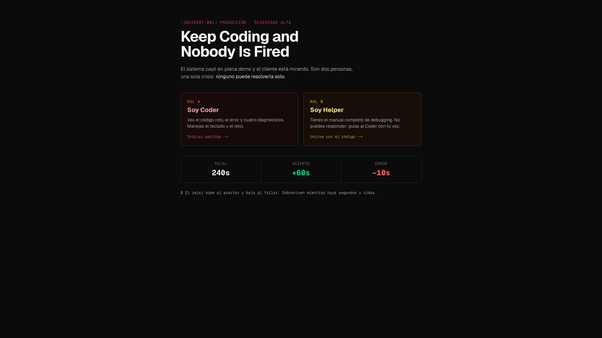
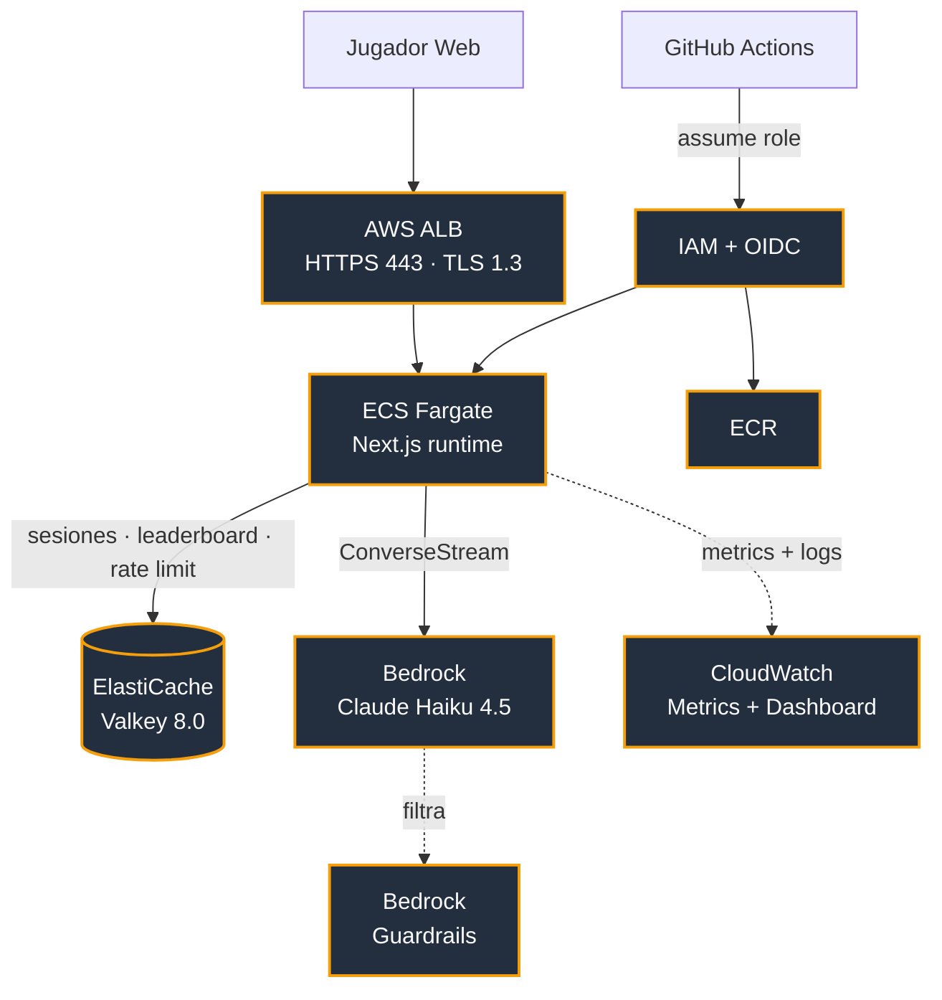

# Keep Coding and Nobody Is Fired

> Un simulador cooperativo de debugging en producción. Dos desarrolladores.
> Un incidente encadenado. Un cliente que mira desde el otro lado del monitor.
> Ninguno de los dos puede resolverlo solo.

**Hackathon:** Códigofacilito × Kiro 2026 — **seleccionado en el Top 30** 🏆
**Equipo:** [@MoisesCorcho](https://github.com/MoisesCorcho) · [@devluismanuel](https://github.com/devluismanuel)
**Estado:** proyecto terminado — la demo en vivo estuvo desplegada en AWS durante la hackathon y **hoy está apagada** ([por qué](#la-demo-en-vivo-y-por-qué-está-apagada))

---

## Vistazo



_Pantalla de inicio: el incidente, los dos roles asimétricos (Coder / Helper) y las reglas del reloj._

📸 **Recorrido visual completo** — sala en vivo, ambos roles, victoria, derrota y el mentor IA:
→ [Galería en el repo (`docs/GALLERY.md`)](docs/GALLERY.md)

---

## ¿Por qué es diferente?

- **La cooperación es imposible de trampear — y no por confianza, sino por código.** Un validador determinista ([`cooperative-integrity.ts`](src/features/game/cooperative-integrity.ts)) compara el diff entre el código roto y su parche, y **rechaza cualquier reto donde el Helper podría dictar la respuesta** sin que el Coder describa el síntoma. La información partida no es una regla de honor: está garantizada por el motor.
- **IA generativa con red de seguridad.** AWS Bedrock (Claude Haiku 4.5) crea cada incidente en vivo, token por token. Si el modelo falla, se pasa de tiempo o filtra la respuesta, el sistema cae a un catálogo curado — **el juego nunca se rompe por culpa de la IA.**
- **Un género que no existe en edu-tech.** *Keep Talking and Nobody Explodes* aplicado al debugging de producción real: entrena una habilidad que nadie practica —comunicación técnica bajo presión— y la vuelve medible (puntaje, rachas, ranking) y con feedback de un mentor IA al final.
- **Corre en AWS de verdad, no en un mock.** ECS Fargate + ALB + ElastiCache Valkey, desplegado por CI con OIDC. La demo que ves es la arquitectura real.

---

## En 30 segundos

Dos desarrolladores entran en la misma sala. Uno se sienta al teclado (el **Coder**) y ve un error 500 en producción mientras un cliente ficticio mira la demo desde el otro lado. El otro (el **Helper**) ve la teoría del framework y contexto del dominio, pero no ve el código roto. Tienen un reloj corriendo, tres vidas cada uno, y una IA generando el próximo bug en vivo — token por token — en pantalla.

Lo único que los saca del pozo es hablar entre ellos. Si el Helper dicta la respuesta sin oír el síntoma, el juego pierde su sentido; si el Coder responde sin escuchar la teoría, se queda sin vidas en dos rondas. La partida sube de dificultad ronda a ronda, con encuentros de "jefe final" cada 10 rondas y auditorías sorpresa que castigan cualquier ruido de comunicación.

Al terminar, un **mentor IA** analiza la partida en vivo y les dice qué hicieron bien, qué no, y en qué enfocarse para la próxima. El puntaje entra a un ranking global compartido en tiempo real.

Todo esto corre sobre **AWS Bedrock (Claude Haiku 4.5)** para generación e IA, **ElastiCache Valkey 8** para estado compartido, **ECS Fargate + ALB + HTTPS** para el runtime, y **Kiro IDE** para el proceso de desarrollo (specs, steering, agent hooks).

---

## El problema que resuelve

**Los desarrolladores no practican debugging bajo presión.** No practican comunicación técnica bajo estrés. No practican coordinar en tiempo real con otra persona para diagnosticar un incidente. Sin embargo, es exactamente lo que tienen que hacer el día que producción se cae con clientes mirando.

Este juego convierte esa habilidad en una mecánica entrenable, medible y divertida:

| Contexto | Uso concreto |
|---|---|
| **Educación** | Bootcamps y universidades pueden usarlo para enseñar debugging colaborativo sin necesidad de un incidente real. |
| **Onboarding** | Un dev nuevo y su mentor juegan una ronda: el nuevo aprende a describir síntomas; el mentor aprende a guiar sin dictar. |
| **Team building** | Retros que no son otra reunión más. Presión real, riesgo cero, feedback IA al final. |
| **Assessment técnico** | Evalúa comunicación técnica y razonamiento bajo tiempo, no solo sintaxis. |

El diseño está inspirado en *Keep Talking and Nobody Explodes* (información obligatoriamente partida entre dos jugadores) trasladado a un dominio real: **el debugging de código de producción**.

---

## Cómo se juega

### Dos roles asimétricos

| Rol | Ruta | Qué ve | Qué hace |
|---|---|---|---|
| **Coder** | `/coder` | Código roto, error, 4 opciones de diagnóstico, timer, 3 vidas propias, racha, ronda, ranking al final | Diagnostica, responde, avanza el reloj |
| **Helper** | `/helper` | Guía completa (reglas del lenguaje + conocimiento de dominio), timer, progreso del Coder, 3 vidas propias, consultas del cliente en modal | Guía verbalmente, atiende consultas del cliente que aparecen en su pantalla |

### La regla de oro (información partida)

> **Ninguno gana solo.**

El Coder ve los síntomas (código, error, opciones) pero **no** las reglas de dominio. El Helper ve la teoría abstracta y contexto (rutas del sistema, convenciones del framework) pero **no** el código ni el error. La respuesta correcta emerge cuando el Coder describe el síntoma y el Helper cruza la teoría — no antes.

Esta regla no depende de la buena fe: un **validador determinista** (`cooperative-integrity.ts`) rechaza cualquier challenge donde el Helper podría dictar la solución sin que el Coder hable. Si Bedrock alguna vez genera un challenge que filtra la respuesta en las pistas del Helper, el sistema lo descarta y usa el catálogo curado como fallback.

### Consultas del cliente (presión externa)

Durante la partida, el **cliente ficticio** interrumpe al Helper con preguntas técnicas en un modal obligatorio (cada ~40 segundos, hasta 6 por partida). El Helper debe responder:

- **Correcto:** +5 segundos al timer, el cliente queda tranquilo por ahora.
- **Incorrecto:** −10 segundos, −1 vida del Helper, el modal se mantiene hasta acertar o llegar a game over.

El Coder no puede ayudar (no ve el modal). Es tensión pura sobre el rol menos protagónico.

### El fin de la partida

- **Reloj a 0** → derrota por `timeout`.
- **Coder sin vidas** → derrota por `coder_lives`.
- **Helper sin vidas** → derrota por `helper_lives`.
- **Uno abandona** → partida terminada.

Al terminar (en modo infinito), ambos jugadores ven:

1. **Resumen de la partida** — rondas alcanzadas, puntaje con combos, tiempo sobrevivido, mejor racha, lenguaje con más fallos, dificultad máxima.
2. **Análisis del mentor IA** — Bedrock escribe en vivo un análisis mentor-style: qué salió bien, patrón de fallos, un consejo accionable.
3. **Top 10 global** — ranking en tiempo real. El Coder registra el nombre del equipo; ambos ven su posición.
4. **Tarjeta compartible** — PNG descargable con el puntaje del equipo para las redes.

---

## Sistemas en juego

Ocho sistemas integrados que interactúan durante una partida:

### 1. Modo infinito con reloj acumulativo

Rondas encadenadas hasta perder. El reloj no reinicia por ronda: sube cuando aciertas (+60s por ronda, +120s por jefe), baja cuando fallas (−10s), y define uno de los tres game overs. Base inicial: **240 segundos**.

### 2. Dificultad adaptativa por ronda

La IA escala el nivel del bug de forma automática:

| Rondas | Dificultad | Perfil |
|---|---|---|
| 1–3 | Easy | Bug evidente, distractores obvios |
| 4–7 | Medium | Bug plausible, distractores creíbles |
| 8–12 | Hard | Bug sutil, distractores muy creíbles |
| 13+ | Expert | Varios bugs sutiles encadenados dentro del challenge |

Esto se inyecta en el prompt de Bedrock; el fallback curado mantiene la sensación aunque la IA falle.

### 3. Sistema de vidas dual

**3 vidas por rol, independientes.** El Coder pierde vida por diagnóstico incorrecto; el Helper por consulta del cliente errada. Un rol a 0 vidas termina la partida para ambos. Cada error también cuesta 10 segundos, así que el juego termina por lo que llegue primero.

### 4. Combos con multiplicadores

Aciertos consecutivos suben el multiplicador de puntaje:

| Racha | Multiplicador |
|---|---|
| 3–4 | ×1.5 |
| 5–6 | ×2 |
| 7+ | ×3 |

Un error rompe la racha y baja el multiplicador a ×1. `bestStreak` se persiste para el resumen. El puntaje final es `endlessScore = (playedRounds × 1000 + segundos) + comboScore`.

### 5. Encuentros con el jefe

Cada **10 rondas**, aparece un **jefe final**: challenge de **4–6 pasos** con memoria entre pasos (una decisión anterior condiciona la respuesta correcta de un paso posterior). No es más difícil, es de otro formato: sostener el contexto de la conversación cross-step. El bono es +120s y +2000 puntos.

Entre rondas normales, dos eventos sorpresa aleatorios (20% de probabilidad):

- **Auditoría sorpresa** — el bono de tiempo baja a la mitad.
- **El jefe está mirando** — los errores del Coder cuestan el doble.

### 6. Preguntas del cliente

Modal obligatorio para el Helper (`~40s` de cooldown, `~45%` probabilidad de spawn, máx. 6 por partida). Cuatro categorías: arquitectura, programación, SQL, patrones de diseño. Reglas descritas arriba.

### 7. Mentor IA post-partida (streaming SSE)

Al game over del modo infinito, un panel dedicado abre una conexión SSE a `/api/game/feedback-stream`. Bedrock genera en vivo, token por token, un análisis mentor-style en español neutro de 120–220 palabras: qué hicieron bien, patrón de fallo, un consejo accionable. Hay botón "Copiar análisis" al terminar.

### 8. Leaderboard global (Valkey sorted sets)

Al game over, el Coder registra el nombre del equipo. Servidor **deriva el puntaje** del estado persistido (no del cliente — anti-fraude) y hace `ZADD` en un `sorted set` de Valkey. Lectura del top 10 con `ZREVRANGE`. La posición se calcula con `ZREVRANK`, incluso si el equipo cae fuera del top 10 visible. Idempotencia por sesión: un retry no infla el ranking.

---

## Cómo lo construimos

### Arquitectura AWS



**Todos los servicios AWS que corren en producción:**

| Servicio | Uso concreto |
|---|---|
| **Bedrock** (Claude Haiku 4.5) | Generación de challenges (`ConverseStream`), análisis mentor post-partida, streaming visible al jugador |
| **Bedrock Guardrails** | Filtro de contenido inapropiado sobre los prompts (`ApplyGuardrail`) |
| **ECS Fargate** | Runtime del app (256 CPU / 512 MB), deploy con circuit breaker + auto-rollback |
| **ALB + ACM** | HTTPS con TLS 1.3, redirect 80→443, health checks |
| **ElastiCache Valkey 8** | Sesiones (`SETEX` con TTL 1h), leaderboard (`ZADD`/`ZREVRANGE`), rate limit (`INCR`/`EXPIRE`) |
| **ECR** | Registry de la imagen `amd64` |
| **CloudWatch** | Dashboard `keep-coding-game` con métricas de Bedrock (invocaciones, latencia, tokens), ALB y Fargate, más **estimación de costo en USD** |
| **S3 + ALB access logs** | Log por request (IP, user-agent, ruta) para separar tráfico real de bots — consultable con Athena, retención 30 días. Ver [`docs/observabilidad.md`](docs/observabilidad.md) |
| **IAM + OIDC** | CI/CD sin API keys — GitHub Actions asume rol vía OIDC |
| **Route 53 + Hostinger DNS** | `hackaton.dvloper.com.co` con validación ACM |

**Todo escrito en Terraform** — `infra/main.tf`, `infra/elasticache.tf`, `infra/guardrail.tf`, `infra/https.tf`, `infra/observability.tf`, `infra/access-logs.tf`, `infra/oidc.tf`.

**CI/CD:** push a `main` dispara `.github/workflows/deploy.yml` → pnpm install + lint + test → build amd64 → push ECR → `ecs update-service --force-new-deployment` (~1min 30s). Un test rojo o un lint warning aborta el deploy.

### Cómo usamos Kiro

Kiro IDE fue el motor del proceso de desarrollo, no solo un editor. Concretamente:

- **`.kiro/specs/`** — 17 features especificadas antes de implementar: requirements → design → tasks. El proceso Kiro forzó pensar cada mecánica (endless mode, combos, boss encounters, cooperative-prompt-integrity, leaderboard, game-results, mentor IA) antes de escribir código. Los tasks.md se actualizan al día para reflejar el estado real.
- **`.kiro/steering/`** — 3 archivos que se cargan en cada sesión (`product.md`, `tech.md`, `structure.md`). Aseguran que cualquier iteración con Kiro tenga contexto correcto: reglas del proyecto (cero `any`, sin `as`, español neutro), stack pinneado (Node 22, pnpm 9.15.0, Next 16.2.11, React 19.2.4), y arquitectura layered feature-based.
- **Agent Hooks** — hooks locales (`.kiro/hooks/`) que corren tests, lint y verificaciones al guardar/commitear archivos críticos.
- **Trabajo colaborativo con Kiro** — la mayoría de las features fueron producidas en pares humano + Kiro (specs y decisiones arquitectónicas humanas, implementación asistida). El repo muestra el patrón: PRs pequeños encadenados, commits por unidad de trabajo, tests que nacen con el código.

### Decisiones de diseño clave

- **Lógica pura vs. I/O separadas por diseño.** `src/features/game/game-engine.ts` es 100% función pura: recibe estado, devuelve estado, sin Bedrock, sin Redis, sin red. Toda la I/O vive en `game-service.ts` y `runtime-generator.ts`. Esto hace que el motor sea trivial de testear — 410 tests, todos ejecutan en <1 segundo.
- **Fallback curado como red de seguridad de la demo.** Si Bedrock falla, timeout, o devuelve un challenge inválido, el sistema cae al catálogo JSON (`src/data/challenges/`) sin que el jugador se entere. Cuatro challenges curados: `login-chaos`, `laravel-routes`, `catalog-controller`, y un `boss-deploy-cascade` para las rondas de jefe. **El loop nunca se rompe en la demo.**
- **`correct_answer` nunca sale al cliente.** El cliente manda solo un `answerIndex`; el servidor valida contra el estado persistido. Anti-cheat estructural, no una defensa periférica.
- **Tokens opacos por rol y por sesión.** Coder y Helper reciben tokens generados con `randomBytes(32)`; toda mutación (answer, tick, abandon, client-question) valida el token con comparación timing-safe. IDOR estructural en cero.
- **Rate limit fixed-window fail-open.** Cualquier endpoint que llame a Bedrock (`/api/game/generate-stream`, `/api/game/feedback-stream`) pasa por `rate-limit.ts` con `INCR`/`EXPIRE`. Si Valkey cae, el rate limit falla abierto (el juego no se rompe por rate-limit) pero la tasa se sigue midiendo.

---

## La demo en vivo (y por qué está apagada)

Durante la hackathon, este proyecto estuvo desplegado en AWS y jugable en
`hackaton.dvloper.com.co`: ECS Fargate detrás de un ALB con HTTPS, sesiones
compartidas en ElastiCache y los incidentes generados en vivo por Bedrock.
No era un mock ni un video — la gente entró y jugó.

**Esa infraestructura se apagó el 1 de septiembre de 2026.** El crédito de capa
gratuita de AWS que la sostenía llegó a su fin, y mantener un ALB, un nodo de
ElastiCache y una tarea Fargate corriendo 24/7 después de que el evento terminó
costaba ~45 USD al mes por una demo que ya cumplió su propósito. Preferimos
apagarla a tiempo y dejar la evidencia documentada.

Lo que sí queda, y es verificable:

- **[La galería completa](docs/GALLERY.md)** — el recorrido de una partida real, capturado de la demo mientras corría en producción.
- **Todo el código** de este repo, incluida la [infraestructura como código](infra/) que la levantaba. `terraform apply` la reconstruye entera.
- **[Cómo correrlo en local](#correr-en-local)** — con Docker, en dos comandos. El juego funciona completo; solo la generación por IA necesita credenciales de Bedrock, y si no las hay cae al catálogo curado y se juega igual.

### Cómo se jugaba

1. Abrir el juego en dos pestañas (o dos dispositivos).
2. Pestaña 1 → **Soy Coder** → aparece un código de sala (ej. `X7K2`).
3. Pestaña 2 → **Soy Helper** → ingresa el mismo código.
4. Coordinarse en voz alta.
5. Con Bedrock activo, el challenge se escribe en pantalla token por token.

Recomendado: con audio abierto entre las dos personas — es cooperativo por
diseño y aburre jugarlo en silencio. Corriéndolo en local funciona igual.

---

## Stack técnico

| Capa | Tecnología | Versión | Rol |
|---|---|---|---|
| Runtime | Node.js | 22 (LTS) | Servidor Next |
| Framework | Next.js | 16.2.11 | App Router, API routes, SSR, `next/og` |
| UI | React | 19.2.4 | Server + Client Components |
| Lenguaje | TypeScript | 5.x (strict) | Cero `any`, sin `as` casts |
| Estilos | Tailwind CSS | 4 (`@tailwindcss/postcss`) | Utility-first |
| Tests | Vitest | 4.x | 410 tests, <1s |
| Linter | ESLint | 9.x (`--max-warnings 0`) | CI aborta con cualquier warning |
| Package manager | pnpm | 9.15.0 (via `corepack`) | Determinista, pinneado |
| Redis client | ioredis | 5.x | Valkey 8.0 (ElastiCache) |
| AWS SDK | `@aws-sdk/client-bedrock-runtime` | 3.x | Streaming + guardrails |
| IaC | Terraform | AWS provider ≥ 6.23 | Todo el infra |
| Hooks | Husky | 9.x | Pre-push guardrail |

> **Nota (AGENTS.md):** Next 16 tiene breaking changes vs training data reciente (`params` y `searchParams` async en pages/metadata; `Image` de metadata async). Los route handlers siguen sincrónicos. Ver `node_modules/next/dist/docs/` para la API vigente.

---

## Correr en local

### Prerrequisitos

- Node.js 22+ (ver `.nvmrc`)
- pnpm 9.15.0 (activar con `corepack enable`)
- (Opcional) Docker + `compose.yaml` para levantar Valkey local
- (Opcional) Credenciales AWS con acceso a Bedrock para generación real; si no, se usan los challenges curados

### Setup

```bash
git clone git@github.com:dvloper-mnt/Keep-Coding-and-Nobody-Is-Fired.git
cd Keep-Coding-and-Nobody-Is-Fired

corepack enable
pnpm install

# Opcional — Valkey local (host 6380 → contenedor 6379 para no chocar con otros Redis)
docker compose up -d

# Copiar env de ejemplo y ajustar
cp .env.local.example .env.local

# Dev server
pnpm dev
```

Abre [http://localhost:3000](http://localhost:3000).

### Scripts

```bash
pnpm dev                 # servidor de desarrollo
pnpm build               # build de producción
pnpm start               # servidor de producción
pnpm lint                # ESLint (CI: --max-warnings 0)
pnpm test                # Vitest (vitest run)
pnpm test:watch          # Vitest en watch
pnpm test:coverage       # cobertura
pnpm generate:questions  # genera challenges con Bedrock (tsx script)
```

### Variables de entorno

```dotenv
# Bedrock (opcional en dev — sin esto, usa catálogo curado)
AWS_REGION=us-east-1
BEDROCK_MODEL_ID=us.anthropic.claude-haiku-4-5-20251001-v1:0
BEDROCK_GUARDRAIL_ID=            # opcional
BEDROCK_GUARDRAIL_VERSION=       # opcional
BEDROCK_RUNTIME_TIMEOUT_MS=20000

# Valkey / Redis (opcional en dev — sin esto, fallback a memoria)
REDIS_HOST=localhost
REDIS_PORT=6380  # con compose.yaml local

# Ajuste de balance opcional
ENDLESS_BASE_SECONDS=240
ENDLESS_REWARD_SECONDS=60
```

En producción, `REDIS_HOST` es **obligatorio** — si falta, el servicio lanza fail-fast en vez de degradarse silenciosamente a memoria (bug histórico ya resuelto).

---

## Estructura del proyecto

```
app/
  page.tsx                       # Landing (typewriter hero, selector de rol)
  coder/page.tsx                 # Pantalla del Coder
  helper/page.tsx                # Pantalla del Helper
  api/game/
    start/route.ts               # POST — crea sala
    state/route.ts               # GET — vista del Coder
    guide/route.ts               # GET — guía del Helper
    sync/route.ts                # GET — timer/progreso del Helper
    answer/route.ts              # POST — enviar diagnóstico
    tick/route.ts                # POST — decrementar timer
    client-question/route.ts     # POST — responder consulta del cliente
    generate-stream/route.ts     # GET — SSE del challenge en vivo
    feedback-stream/route.ts     # GET — SSE del mentor IA
    leaderboard/route.ts         # GET/POST — top 10 y registro
    share-card/route.tsx         # GET — OG image (next/og)
    abandon/route.ts             # POST — abandonar sesión

src/
  features/game/
    game-engine.ts               # Lógica PURA
    game-service.ts              # Sesiones, Valkey, transiciones de ronda
    runtime-generator.ts         # Bedrock Converse + ConverseStream + guardrail
    feedback-generator.ts        # Bedrock streaming del mentor IA
    game-types.ts                # Interfaces TypeScript (fuente de verdad)
    challenge-schema.ts          # Validación estructural del Challenge
    cooperative-integrity.ts     # Anti-leak: rechaza challenges que filtran
    boss-encounters.ts           # Lógica pura del jefe y eventos
    challenge-difficulty.ts      # roundToDifficulty + difficultyInstruction
    lives-engine.ts              # loseLife, normalizeSessionLives
    leaderboard-score.ts         # sanitizeTeamName + scoreFromGameOver
    leaderboard-store.ts         # ZADD/ZREVRANGE + fallback en memoria
    run-summary.ts               # Resumen post-partida (puro)
    share-score.ts               # URLs de share intent (X/LinkedIn/Facebook)
    share-card-params.ts         # Parseo seguro de query params de la card
    streaming-preview.ts         # Extrae title/story mientras Bedrock stream-ea
    rate-limit.ts                # Fixed-window fail-open sobre Valkey
    session-credentials.ts       # Tokens opacos con crypto.randomBytes
    session-mutex.ts             # Lock por sesión para transiciones concurrentes
    api/game-client.ts           # Cliente fetch tipado
    hooks/                       # useCoderGame, useHelperGame, useChallengeStream,
                                 # useFeedbackStream, useLeaderboardTop, ...
    testing/fixtures.ts          # Fixtures tipadas (no duplicar mocks entre specs)

  components/                    # Uno por archivo, PascalCase
    atoms/                       # LivesIndicator, GameTimer, CodePanel, ...
    molecules/                   # ConfirmDialog, ExitButton, ShareScoreButtons, ...
    organisms/                   # CoderBoard, HelperBoard, LeaderboardPanel,
                                 # RunSummaryPanel, AiFeedbackPanel, BossOverlay, ...
    containers/                  # CoderScreen, HelperScreen

  data/
    challenges/                  # login-chaos, laravel-routes, catalog-controller,
                                 # boss-deploy-cascade (fallback curado)
    client-questions/            # Pool estático de preguntas del cliente

  lib/
    constants.ts                 # Todas las constantes de balance del juego
    defeat-messages.ts           # Copy por (rol × DefeatReason)
    boss-position.ts             # Zonas seguras del BossOverlay
    game-audio.ts                # Sonidos (correcto/error/tick)

infra/                            # Terraform — un archivo por dominio
  main.tf                        # ECS + ALB + IAM policies + task def
  network.tf                     # VPC, subnets, security groups
  elasticache.tf                 # Valkey 8.0
  https.tf                       # ACM + listener 443
  guardrail.tf                   # Bedrock Guardrail
  observability.tf               # CloudWatch dashboard (costos + latencia + tokens)
  access-logs.tf                 # ALB access logs → S3 (bucket + policy + lifecycle)
  oidc.tf                        # GitHub Actions OIDC trust
  dev-access.tf                  # Usuario IAM least-privilege para Bedrock local

.kiro/
  specs/                         # 17 features especificadas (req → design → tasks)
  steering/                      # product, tech, structure (siempre en contexto)

.github/workflows/deploy.yml     # CI/CD amd64 → ECR → ECS force-new-deployment
compose.yaml                     # Valkey 8-alpine local
Dockerfile                       # Node 22 + pnpm + build amd64
```

Import alias: `@/*` mapea a la raíz del proyecto.

---

## API

Todos los endpoints están bajo `app/api/game/*`. Los que mutan estado piden token opaco por rol; los de lectura no.

| Método | Endpoint | Rol | Auth | Descripción |
|---|---|---|---|---|
| `POST` | `/api/game/start` | Coder | — | Crea sala. Devuelve `{ sessionId, coderToken }` |
| `GET` | `/api/game/state?sessionId=` | Coder | — | Vista del paso actual (code, error, opciones filtradas) |
| `GET` | `/api/game/guide?sessionId=&token=` | Helper | Helper token | Guía completa del challenge (primera visita mintea `helperToken`) |
| `GET` | `/api/game/sync?sessionId=` | Helper | — | Timer, ronda, progreso, consultas del cliente activas |
| `POST` | `/api/game/answer` | Coder | Coder token | Diagnóstico. `{ sessionId, answerIndex, token }` |
| `POST` | `/api/game/tick` | Coder | Coder token | Decrementa 1s (rate-limited al segundo) |
| `POST` | `/api/game/client-question` | Helper | Helper token | Responder al cliente (afecta timer + vidas) |
| `POST` | `/api/game/abandon` | Ambos | Token del rol | Salir de la sala |
| `GET` | `/api/game/generate-stream?sessionId=` | Coder | — | SSE del challenge generado por Bedrock (decorativo — el board se arma solo del challenge validado) |
| `GET` | `/api/game/feedback-stream?sessionId=&token=` | Coder | Coder token | SSE del mentor IA (solo al game over endless) |
| `GET` | `/api/game/leaderboard` | Público | — | Top 10 global |
| `POST` | `/api/game/leaderboard` | Coder | Coder token | Registra puntaje (score derivado server-side, idempotente por sesión) |
| `GET` | `/api/game/share-card?score=&rounds=&team=` | Público | — | PNG 1200×630 del equipo (via `next/og`) |

---

## Balance del juego

Todos los valores viven en `src/lib/constants.ts` para ajuste rápido sin tocar la lógica.

| Constante | Valor | Nota |
|---|---|---|
| `ENDLESS_BASE_SECONDS` | 240s | Reloj inicial en modo infinito |
| `ENDLESS_REWARD_SECONDS` | +60s | Bono por ronda completada |
| `BOSS_REWARD_SECONDS` | +120s | Bono por vencer al jefe |
| `BOSS_SCORE_BONUS` | +2000 pts | Bono de puntaje del jefe |
| `BOSS_EVENT_CHANCE` | 20% | Probabilidad de evento sorpresa en ronda normal |
| `PENALTY_SECONDS` | −10s | Penalización por respuesta incorrecta |
| `MAX_LIVES` | 3 | Vidas por rol (independientes) |
| `COMBO_BASE_PER_HIT` | 100 pts | Base del bono de combo, antes de multiplicar |
| `STREAK_TIERS` | ×1.5 / ×2 / ×3 | Multiplicadores a rachas 3+/5+/7+ |

Modo clásico (partida única): reloj fijo de 180s, sin combos, sin escalado.

---

## Tests y calidad

- **Vitest** ejecuta 410 tests en <1 segundo (lógica pura).
- **TypeScript strict** con **cero `any`** y sin `as` casts (salvo `as const` y `satisfies`).
- **ESLint** en CI corre con `--max-warnings 0` — cualquier warning aborta el deploy.
- **Husky pre-push** guardrail contra pushes sin verificar.
- **Pattern testing**: fixtures tipadas en `src/features/game/testing/fixtures.ts` — no se duplican mocks entre specs.
- **TDD estricto** para lógica pura: test primero, después implementación. Aplicado a: game-engine, lives-engine, boss-encounters, combos, cooperative-integrity, leaderboard-score, run-summary, share-card-params.

```bash
pnpm test              # 410 tests
pnpm exec tsc --noEmit # 0 errores
pnpm lint              # 0 warnings
```

---

## Roadmap

Todo el roadmap original de la auditoría (endless mode, adaptive difficulty, combos, boss, leaderboard, game-results, mentor IA) está **en producción**. Lo que sigue:

- **Multi-idioma en UI** — hoy la UI es en español; el juego internamente ya soporta 8 lenguajes de programación para los challenges.
- **Modo tutorial** — una primera partida guiada que enseñe la asimetría cooperativa.
- **WebSockets** — hoy usamos polling + SSE (funciona bien y es simple); WS sería la evolución natural para latencia mínima.
- **Persistencia de historial de partidas por equipo** — hoy el leaderboard es global anónimo.
- **API pública** — abrir un endpoint para que otras plataformas educativas embeban partidas.

---

## Créditos

Un proyecto de **Dvloper** para el hackathon de **Códigofacilito × Kiro (2026)**.

<table>
  <tr>
    <td align="center" width="180">
      <a href="https://github.com/MoisesCorcho">
        <br/>
        <sub><b>Moisés Corcho</b></sub><br/>
      </a>
      <sub>@MoisesCorcho</sub>
    </td>
    <td align="center" width="180">
      <a href="https://github.com/devluismanuel">
        <br/>
        <sub><b>Luis Manuel Zuñiga</b></sub><br/>
      </a>
      <sub>@devluismanuel</sub>
    </td>
  </tr>
</table>

**Herramientas de referencia:** [Kiro IDE](https://kiro.dev/) como driver del proceso (specs, steering, hooks); [AWS Bedrock](https://aws.amazon.com/bedrock/) (Claude Haiku 4.5) para toda la IA en el juego; [Códigofacilito](https://codigofacilito.com/) por organizar el hackathon.

**Inspiración de diseño:** *Keep Talking and Nobody Explodes* (Steel Crate Games) por la mecánica de información obligatoriamente partida.

---

## Licencia

[MIT](LICENSE) © 2026 Luis Manuel Zúñiga Moreno y Moisés Corcho Pérez. Eres libre de usar, copiar, modificar y distribuir el código manteniendo el aviso de copyright.
