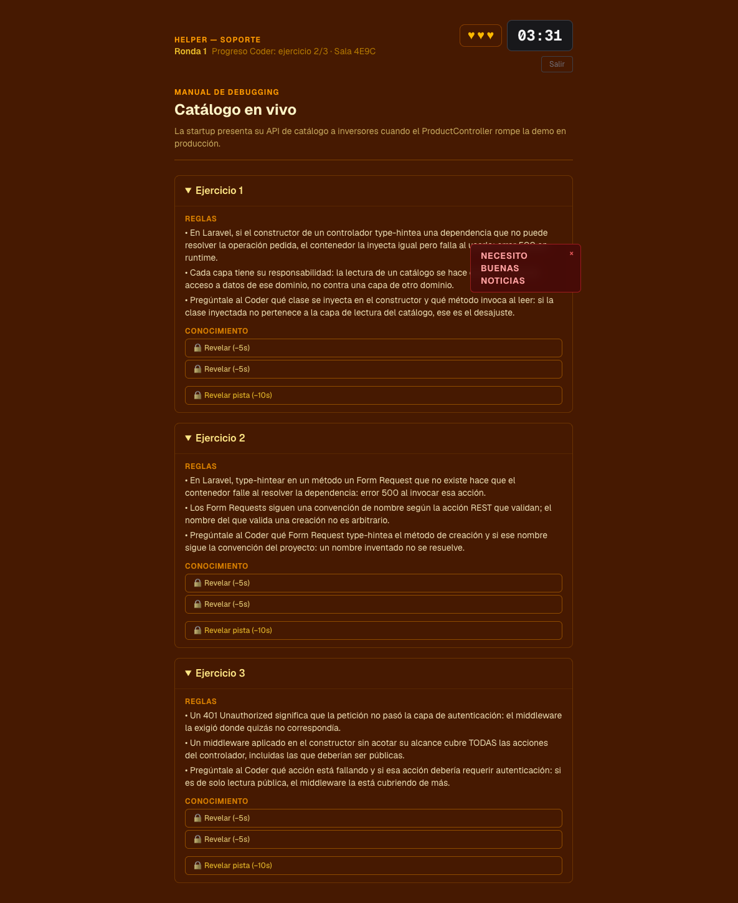

# Galería — Keep Coding and Nobody Is Fired

Recorrido visual del juego, de la sala de incidentes en vivo hasta el veredicto del mentor IA.

> **Todas las capturas de esta galería salieron de la demo corriendo en producción**
> en AWS (`hackaton.dvloper.com.co`) durante la hackathon Códigofacilito × Kiro 2026.
> Esa infraestructura se apagó el 1 de septiembre de 2026 — [por qué](../README.md#la-demo-en-vivo-y-por-qué-está-apagada).
> No son mockups ni diseños: es el juego real, con incidentes generados por Bedrock en vivo.

---

## La sala de incidentes

El punto de entrada: el incidente en producción, los dos roles asimétricos (Coder / Helper) y las reglas del reloj — acierto `+60s`, error `−10s`, base `240s`.

---

## Rol A — Coder

Tiene el teclado, no la teoría. Ve la consola de producción con el error en vivo y cuatro diagnósticos. Depende de que el Helper le explique la teoría por voz.

---

## Rol B — Helper

Tiene la teoría, no el código. Ve el manual de debugging: las reglas son gratis, pero el conocimiento y las pistas están bajo llave y **cuestan tiempo** (`−5s` / `−10s`). Comparte sala, reloj y vidas con el Coder en tiempo real.

---

## La sala compartida, en dos clientes a la vez

La misma partida vista desde el Helper mientras el Coder juega en otro navegador:
la cabecera dice **"Progreso Coder: ejercicio 2/3 · Sala 4E9C"** y el reloj corre
sincronizado en ambos. El estado de la sala vive en **ElastiCache (Valkey)**, no en
el navegador — dos personas en dispositivos distintos comparten reloj, vidas y progreso.

Fíjate en lo que el Helper **no** tiene: el código roto. Solo la teoría, con el
conocimiento bajo llave a `−5s` / `−10s`. La asimetría de información no es una regla
de honor — es lo que el servidor le manda a cada rol.

---

## Victoria — Crisis contenida

Los tres incidentes resueltos entre los dos: el código queda parcheado y la demo termina antes de que el jefe entre al Slack.

---

## Derrota, mentor IA y ranking global

Al perder en modo infinito: resumen de la partida, el **análisis del mentor IA generado en vivo por AWS Bedrock** (Claude Haiku 4.5), y el ranking global compartido donde el equipo entra a competir.

