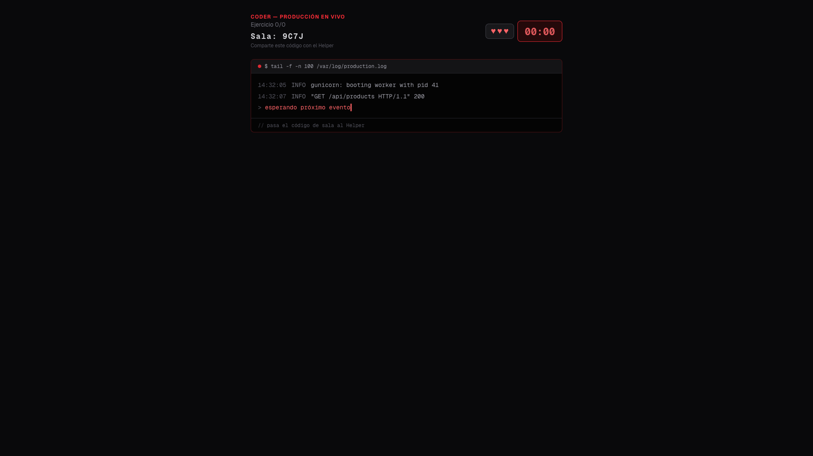
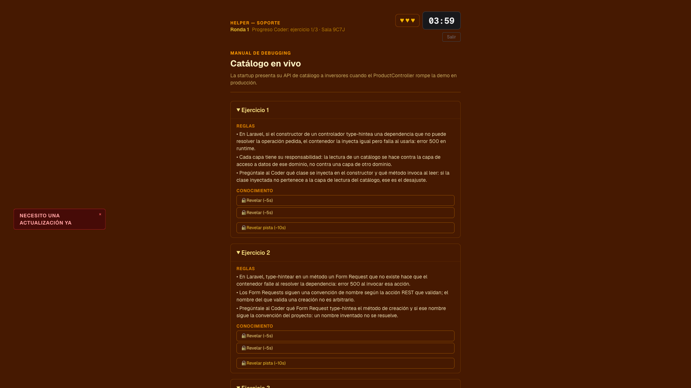
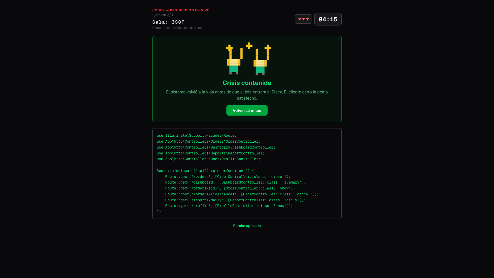
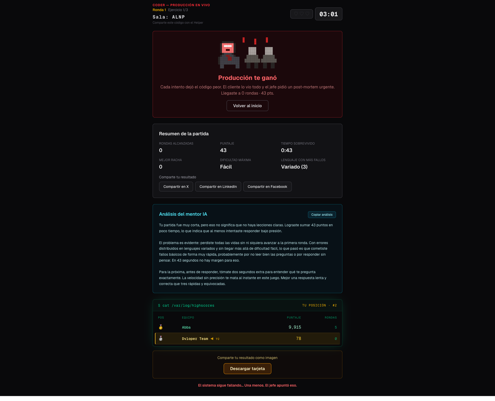

# Galería — Keep Coding and Nobody Is Fired

Recorrido visual del juego, de la sala de incidentes en vivo hasta el veredicto del mentor IA. Todas las capturas son de la [demo en vivo](https://hackaton.dvloper.com.co).

> ¿Prefieres verlo como página? Hay una [galería interactiva](https://dvloper-mnt.github.io/Keep-Coding-and-Nobody-Is-Fired/galeria/) con las capturas a tamaño completo.

---

## La sala de incidentes

El punto de entrada: el incidente en producción, los dos roles asimétricos (Coder / Helper) y las reglas del reloj — acierto `+60s`, error `−10s`, base `240s`.

---

## Rol A — Coder

Tiene el teclado, no la teoría. Ve la consola de producción con el error en vivo y cuatro diagnósticos. Depende de que el Helper le explique la teoría por voz.

---

## Rol B — Helper

Tiene la teoría, no el código. Ve el manual de debugging: las reglas son gratis, pero el conocimiento y las pistas están bajo llave y **cuestan tiempo** (`−5s` / `−10s`). Comparte sala, reloj y vidas con el Coder en tiempo real.

---

## Victoria — Crisis contenida

Los tres incidentes resueltos entre los dos: el código queda parcheado y la demo termina antes de que el jefe entre al Slack.

---

## Derrota, mentor IA y ranking global

Al perder en modo infinito: resumen de la partida, el **análisis del mentor IA generado en vivo por AWS Bedrock** (Claude Haiku 4.5), y el ranking global compartido donde el equipo entra a competir.

